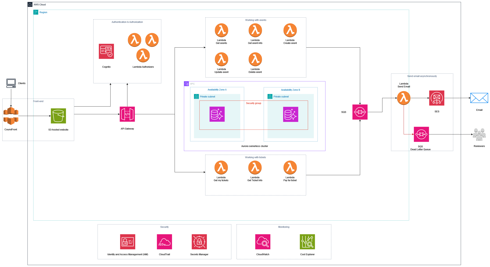

# AWS - Serverless Web Application

This README will provide an overview of the serverless architecture for the application. It will breifly describe each component of the architecture.

Since I couldn't open an AWS account at this stage, I used LocalStack, a service that emulates AWS services locally. I configured the AWS CLI to communicate with LocalStack instead of the AWS cloud. Although LocalStack provides a UI, I primarily used the CLI to better replicate the actual AWS Management Console experience. I turned to the UI mainly when I struggled with the CLI or wanted to track CloudWatch metrics visually.

## Table of Contents

- [Architecture Diagram](#architecture-diagram)
- [Components](#components)
  - [CloudFront](#cloudfront)
  - [S3-hosted Website](#s3-hosted-website)
  - [API Gateway](#api-gateway)
  - [Cognito](#cognito)
  - [Lambda Functions](#lambda-functions)
    - [Authorizers](#authorizers)
    - [Business-logic funcitons](#business-logic-functions)
    - [Asynchronous functions](#asynchronous-functions)
    - [Optimization](#optimization)
  - [Aurora Serverless Cluster](#aurora-serverless-cluster)
  - [Simple Email Service (SES)](#simple-email-service-ses)
  - [Simple Queue Service (SQS)](#simple-queue-service-sqs)
  - [Security and Monitoring](#security-and-monitoring)
    - [Identity and Access Management (IAM)](#identity-and-access-management-iam)
    - [CloudTrail](#cloudtrail)
    - [Secrets Manager](#secrets-manager)
    - [CloudWatch](#cloudwatch)
    - [Cost Explorer](#cost-explorer)
- [Conclusion](#conclusion)

## Architecture Diagram

## Components

### CloudFront

Amazon CloudFront is used as a content delivery network to distribute the web application's static content globally with low latency.

### S3-hosted Website

The front-end of the application is hosted in an Amazon S3 bucket. The bucket is not publicly accessible, and it has a policy that allows the CloudFront instance to access its contents, in a read only manner.

### API Gateway

Amazon API Gateway is used to create the API that the front-end interacts with. It serves as the entry point for all API requests.

### Cognito

Amazon Cognito acts as our identity provider to provide authentication for the application.

### Lambda Functions

AWS Lambda functions are used to execute backend logic in a serverless manner. The functions are categorized into different sets based on their responsibilities: Authorizers, Business-logic, and Asynchronous.

#### Authorizers

Lambda functions in this category are used to handle custom authorization logic.

#### Business-logic functions

Those are responsible for executing the core functionalities and processes that directly relate to the application's business requirements and rules.

#### Asynchronous functions

A Lambda function mapped to an SQS source receives email sending requests from a business-logic function. This asynchronous function processes these events and sends them as email messages via SES.

#### Optimization

Almost all of the functions that are in the same group share common code, dependencies, and environment variables. So I have created a secret in AWS Secrets Manager to store the environment variables shared between group members. I then created a lambda layer for each group, containing the common dependencies and shared code, and removed these dependencies from the individual functions.

This change significantly reduced the deployment package size from 14 MB to 2 KB.

### Aurora Serverless Cluster

An Amazon Aurora Serverless cluster is used as the database for storing application data. A serverless model has been choosed instead of a provisioned one because it automatically scales based on the application's needs which are important due to our application unpredictable traffic spikes. A serveless v2 has been used due to its significant enhancements compared to v1.

### Simple Email Service (SES)

Amazon SES is used to send email notifications to users.

### Simple Queue Service (SQS)

Amazon SQS is used for decoupling synchronous from asynchronous business-logic. A DLQ is configured to capture failed messages for later processing.

### Security and Monitoring

#### Identity and Access Management (IAM)

IAM is used to manage permissions for AWS resources and ensure secure access control.

#### CloudTrail

AWS CloudTrail is enabled to log and monitor API activity across the AWS account.

#### Secrets Manager

AWS Secrets Manager is used to securely store and manage sensitive information such as database credentials and environment variables.

#### CloudWatch

Amazon CloudWatch is used to monitor application performance, resource usage, and logs.

#### Cost Explorer

AWS Cost Explorer is used to track and analyze the application's AWS usage and costs.

## Conclusion

While using localstack for working locally with AWS can provide advantages of testing the workload before shipping them to AWS which can reduce costs, it is not the ideal solution for performance related testing, that is because locally you do not have the optimized infrastructure like the one used in an AWS environment.