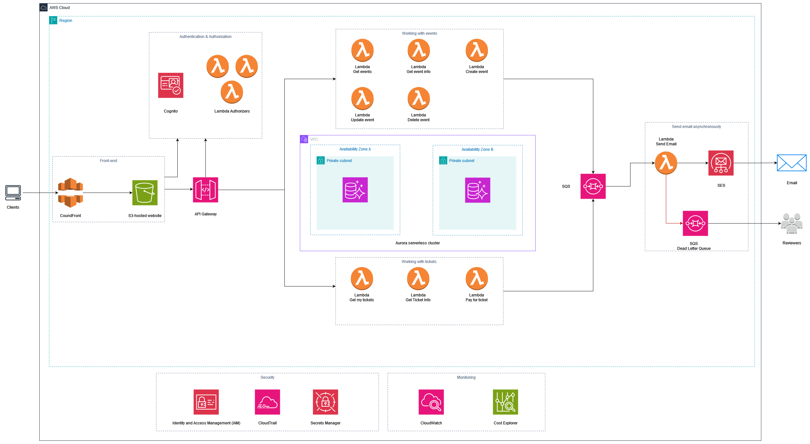

# AWS - Serverless Web Application

This README will provide an overview of the serverless architecture for the application. It will breifly describe each component of the architecture.

This is my first AWS project, since I couldn't open an AWS account at this stage, I used LocalStack, a service that emulates AWS services locally. I configured the AWS CLI to communicate with LocalStack instead of the AWS cloud. Although LocalStack provides a UI, I primarily used the CLI as it is an AWS-native tool, to replicate the actual AWS experience as much as possible. I turned to the UI mainly when I struggled with the CLI or wanted to track CloudWatch metrics visually.

## Table of Contents

- [Architecture Diagram](#architecture-diagram)
- [Run The Application](#runtheapplication)
  - [Prerequisites](#prerequisites)
  - [Steps](#steps)
- [About The Solution](#aboutthesolution)

## Architecture Diagram



## Run The Application

### Prerequisites

To deploy and run the application using the provided deployment script, you need the following command line tools: AWS CLI, git, node, npm, zip, jq, and sed

### Steps

- Clone the project.

```bash
git clone https://github.com/mohamedhafizelhaj/AWS-Serverless-Web-Application
cd AWS-Serverless-Web-Application
```

- Run the deployment script, providing the name of two S3 bucktes, the first one to host the frontend, and the second one to upload lambda functions. The stack will have the name ```Serverless-Web-Application```, but you can optionally choose another name by providing the ```--stack-name``` option.

```bash
chmod +x ./deploy.sh
./deploy.sh <frontend-bucket> <lambda-bucket>
```

- After the stack deploys successfully, you will get the CloudFront distribution URL by which you can access the application.

## About The Solution

Check this [article](https://medium.com/@mohamedhafizelhaj/aws-serverless-web-application-6941380d2a21) for a detailed description of the solution and its components.